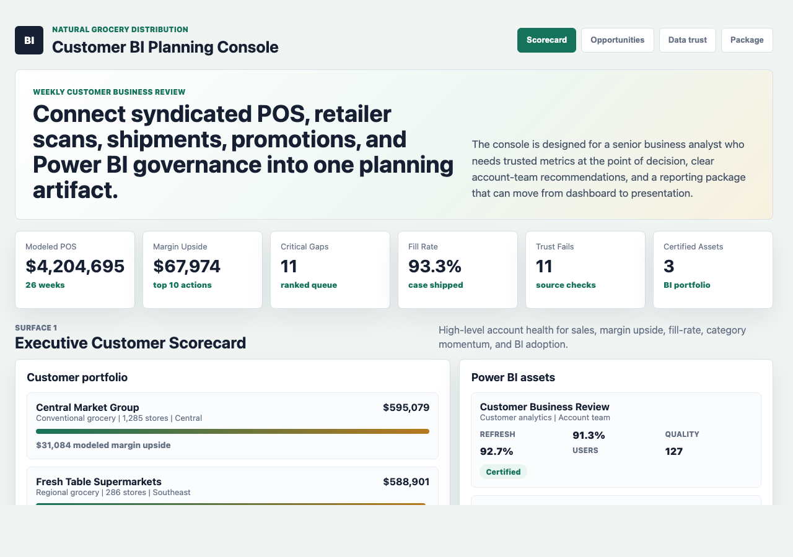
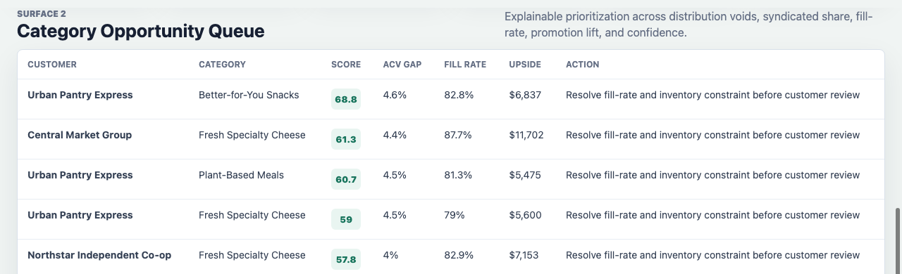
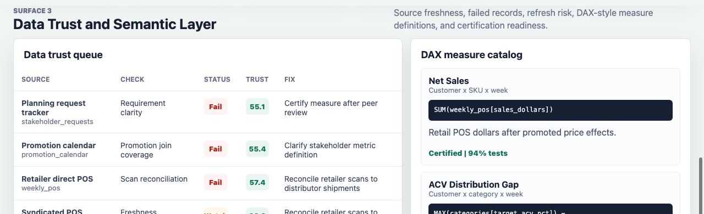
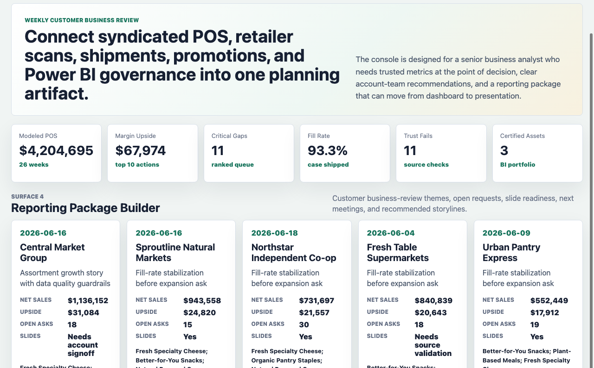

# Natural Grocery Customer BI Planning Console

An interactive BI portfolio artifact for a natural, organic, specialty, and fresh grocery distribution environment. The console shows how a senior business analyst can turn syndicated POS, retailer scan, distributor shipment, promotion, data-quality, Power BI, and stakeholder-request signals into a trusted customer business review.

The artifact is intentionally more than a dashboard. It includes reproducible synthetic operating data, an explainable customer-category opportunity model, Power BI semantic-layer examples, Power Query transformation logic, SQL checks, analysis documentation, and a multi-surface interactive console.

## Screenshots



The executive customer scorecard shows modeled POS, margin upside, critical opportunities, fill rate, data trust failures, certified BI assets, customer portfolio health, and Power BI adoption.



The opportunity queue ranks customer-category actions by ACV distribution gap, syndicated share gap, fill-rate risk, promotion lift, confidence, and estimated margin upside.



The data trust surface shows source checks that can block a customer-facing business review, plus DAX-style semantic measures, certification status, and test coverage.



The reporting package builder converts analysis into customer business-review themes, open stakeholder asks, slide readiness, next meeting dates, and categories to feature in the story.

## What This Demonstrates

- Power BI-style business intelligence for customer planning and account-team decision support.
- DAX, Power Query, SQL, and semantic model thinking behind the dashboard surface.
- Integration of syndicated-style POS, retailer scans, distributor shipments, promotion calendars, item attributes, stakeholder requests, and refresh governance.
- Translation of complex data into executive-ready recommendations and customer-facing reporting packages.
- Data governance discipline through source freshness, failed-record checks, metric definitions, certification status, and test coverage.
- Prioritization across ad hoc requests and structured recurring reporting.

## Data Strategy

The data is synthetic because real syndicated data, retailer-direct extracts, distributor shipments, customer planning notes, promotion calendars, item masters, Power BI refresh logs, and account-team reporting packages are private. The generator uses a fixed random seed so the artifact is reproducible.

The synthetic data is modeled on common natural and specialty grocery analytics structures:

- 5 customer accounts across conventional grocery, natural grocery, independent grocery, regional grocery, and small format.
- 6 natural and specialty categories across refrigerated, grocery, frozen, wellness, and fresh departments.
- 36 SKUs with wellness-oriented product attributes, case packs, base prices, and margin assumptions.
- 26 weeks of customer-SKU POS dollars, units, price, ACV distribution, velocity, syndicated share, competitor share, category growth, retailer scan units, and panel repeat rate.
- Distributor shipment records with ordered cases, shipped cases, fill rate, inventory, PO count, service level, and spoilage risk.
- Promotion records with planned lift, actual lift, feature and display support, compliance, and funding rate.
- Data-quality checks for syndicated POS, retailer direct POS, shipment ERP, promotion calendar, item master, stakeholder requests, and Power BI service.
- Stakeholder requests, Power BI asset inventory, and DAX-style semantic measure definitions.

Generated tables include:

- `data/customers.csv`
- `data/categories.csv`
- `data/skus.csv`
- `data/weekly_pos.csv`
- `data/distributor_shipments.csv`
- `data/promotion_calendar.csv`
- `data/data_quality_checks.csv`
- `data/stakeholder_requests.csv`
- `data/power_bi_assets.csv`
- `data/semantic_measures.csv`
- `analysis/outputs/opportunity_queue.csv`
- `analysis/outputs/data_trust_queue.csv`
- `analysis/outputs/reporting_package.csv`

## Opportunity Model

The opportunity model is explainable by design. It estimates customer-category priority from:

- ACV distribution gap versus a category benchmark.
- Syndicated share gap versus competitor share.
- Fill-rate gap versus a 96 percent service target.
- Promotion lift attainment and merchandising compliance.
- Category growth rate.
- Estimated margin upside.
- Confidence score that penalizes source and operational uncertainty.

This is a prioritization model for recurring business reviews, not a predictive black-box model.

## Power BI and SQL Artifacts

- `analysis/dax_measure_catalog.md`: DAX-style examples for net sales, ACV gap, fill-rate risk, promotion lift attainment, and source trust.
- `analysis/power_query_transformations.pq`: Power Query transformation pattern for shipment typing, fill-rate bands, and inventory signals.
- `analysis/sql_checks.sql`: warehouse-style checks for opportunity logic, data trust, Power BI readiness, stakeholder prioritization, and semantic measure certification.

## Repository Structure

- `index.html`: interactive customer BI planning console.
- `src/app.js`: tabs, tables, scorecards, and calculated display logic.
- `src/data.js`: generated app payload.
- `src/styles.css`: responsive BI console styling.
- `data/`: synthetic source-style operating files.
- `analysis/`: analysis plan, methodology, executive findings, SQL, DAX, Power Query, and scored outputs.
- `scripts/generate_bi_artifact.py`: synthetic data and model output generator.
- `scripts/score_operating_data.py`: command-line summary of the ranked queue and reporting readiness.
- `docs/images/`: rendered screenshots for this README.

## Run Locally

```bash
npm run generate
npm run analyze
npm run start
```

Then open `http://localhost:4173`.

If port 4173 is occupied, run `python3 -m http.server 4199` and open `http://localhost:4199`.

## Role Fit

This artifact maps to a senior business analyst role that owns Power BI reporting, DAX, Power Query, SQL, syndicated data, customer planning analytics, reporting packages, stakeholder presentations, and data governance. It shows the practical workflow behind trusted BI: source data, semantic definitions, quality checks, opportunity scoring, and business-review storytelling.

## Scope

This project does not connect to real distributor systems, real syndicated data, real retailer extracts, a live data warehouse, a Power BI service workspace, or customer-confidential planning materials. It does not claim to represent actual company, customer, retailer, supplier, or category performance. It is a reproducible portfolio artifact that demonstrates BI workflow design, data modeling, governance, analysis, and stakeholder communication.
